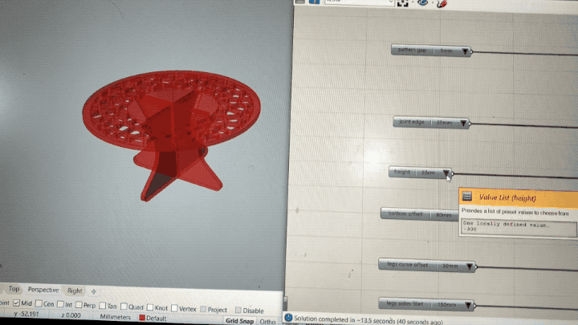

This week I paired with [Ryota Kamio](https://mdef.gitlab.io/ryota.kamio/) for a CNC assignment. We were supposed to make something big and got a whole plywood sheet to do it. By some strange lapse in judgment and a minor miscalculation we ended up milling two tiny stools, using approx. 1/4 of the sheet.

## Modelling

I made the entire model, including the paths for CNC in Grasshopper. It was a tedious and at places cumbersome process.

Despite a very messy file, I was satisfied with the final design, because it allowed me to simply input the size of the parts, tweak the shapes, define thickness of the material and I got an assembled model along with the curves to be used later to configure the CNC machine – I could output a design for a stool as well a table in matter of seconds.

## Laser cutting

It was good that I first laser cut the stool because I have found out that I need to add a bit of an edge to the upper part of the legs so the top would not fall through.

## Milling

Before we could mill we needed to configure the machine using RhinoCAM. We checked for any duplicate curves. Draw circles for screws (for fixing the board to the machine bed). Configured the tool and paths. A finally generated two GCodes to be used by the machine - one for the screws and second for our designs.

We used a plywood 15mm thick and 2400x1250mm in size.

Steps to set up and run the machine:

1. Remove all dust and particles from the bed of the CNC machine
2. Place our sheet of plywood
3. Change the drill bit
4. Home the machine - x/y manually and z using auto-homing attachment
5. Run GCode for screws
6. Fix the plywood in place

## Finishing touches

The piece ended up being shaped a bit like a mushroom, so I decided to give it one last touch by painting in the colours of *Amanita muscaria* mushroom, commonly refereed to as fly agaric.

## Bonus

As part of my final exhibition I fabricated quite a large piece constisting and managed to make a nice timelapse of the CNC process:

<figure>

`vimeo: https://vimeo.com/343954258`

</figure>

So I ended up creating something big after all.

