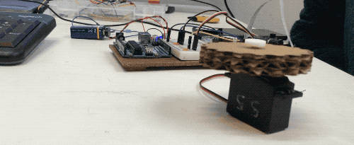
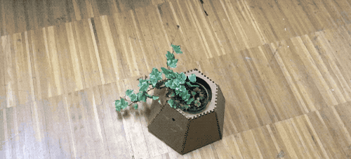

While this project was developed prior to the start of Fab Academy, I found it a suitable for the purposes of documenting the interfaces and applications week since I have been responsible for the majority of the coding on the given project.

<div class="large-image">
    
    
</div>

## A burned Pi

The original idea was to attach a camera to the plant so it could follow and attack its human overlords using facial-recognition software. Initially, I had trouble getting the Raspberry Pi to detect a camera module. I fixed the problem by switching to a different Pi, which unfortunately did not last for long.

It was surprisingly easy to get a object-detection software running using Python and [OpenCV library](https://opencv.org/). But since I was running the recognition on a real-time video feed the Pi’s limited hardware started to freak out and generate a lot of heat. Long story short, the Pi did not turn on after I tried to restart it. It was at this point that I have abandoned the idea of the plant autonomously following humans and instead opted out for controlling it remotely using a web interface.


## Expanding my webdev horizons

This project was my first genuine entry into developing for Raspberry Pi. In theory I knew that Pi is just a simple Linux machine but I had not fully realised the implications of that fact until I have actually booted up the DebianOS and started toying around with it. I quickly realised that it was just like developing on a web server with an added option to plug in a keyboard and mouse and see what is going on an external monitor.

It was a true aha moment when I found out that I can use my web development skills to build something other than a website — say a remotely controlled plant robot.

The basic setup consists of Raspberry Pi running a Flask web server that exposes five API endpoints: `control/up`, `control/down`, `control/left`, `control/right`, `control/stop`. Sending a HTTP request to any of these endpoints sends corresponding instructions to the two motors attached to the Pi allowing it to be controlled remotely. Using the [Dataplicity](https://www.dataplicity.com/) IoT platform I was able to create a direct SSH tunnel to our Pi which allowed us to propagate requests to our local-only Pi’s server by sending a simple HTTP request to API Dataplicity’s endpoints via a custom mobile-ready website.


The front-end code that controls the robot from the website 
(uses jQuery):

```javascript
// joystick.js
function turn(direction) {


  $.ajax({
    type: "POST",
    url: 'https://conniving-grasshopper-2134.dataplicity.io/control/'+direction+'/',
    data: {
      "state": '1'
    }
  });

}

// buttons
$('#up').click(function() {
  turn('up');
});

$('#down').click(function() {
  turn('down');
});

$('#left').click(function() {
  turn('left');
});

$('#right').click(function() {
  turn('right');
});

$('#stop').click(function() {
  turn('stop');
});


// keyboard
$(document).keydown(function(e) {
  switch(e.which) {
      case 32:
      turn('stop')
      break;

      case 37: // left
      turn('left')
      break;

      case 38: // up
      turn('up')
      break;

      case 39: // right
      turn('right')
      break;

      case 40: // down
      turn('down')
      break;

      default: return; // exit this handler for other keys
  }
  e.preventDefault(); // prevent the default action (scroll / move caret)
});
```

## Raspberry me

Working on this project has convinced me about the power and possibilities of Raspberry Pi. I am sure I will use it as a control centre for various sensing and interactive projects in the future.
