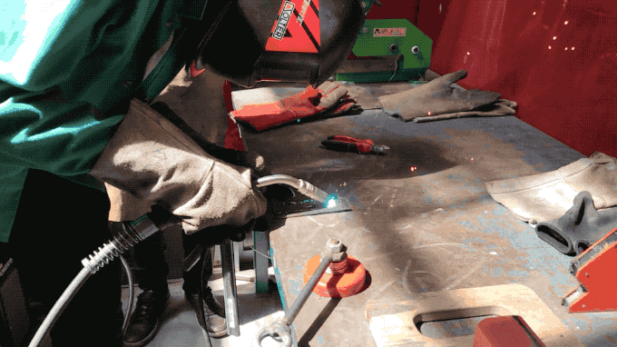

For the wildcard week we got a chance to choose different activities only our lab could provide. I choose to weld, as I have never tried it before and found the process intriguing.

We have started with safety instructions which are particularly important in this case where we are dealing with extremely high temperatures. We had to wear green coats made out of fireproof material, gloves, and most importantly we had to wear mask.

There are two types of masks — passive and active. Active ones automatically darken as soon as you start welding and otherwise provide much clearer view of the outside compared to the passive ones which always stay dark so you usually need to lift it up whenever you stop welding to see you progress.

Before you start welding, you need to attach your pieces to a table with clamps. You should try and have them laid down as flat as possible. One of the pieces needs to have the ground attached to it so you could actually create a circuit when welding.

The machine allows you to set different configurations — voltage, ampere and speed at which wire is extruded out of the welding gun. There are no universal rules here, you simply have to find the sweet spot that fits your needs by good ol' trial and error.

The actual welding is done with a gun that extrudes a wire when you pull the trigger. When this material touches the surface of the parts to be welded, it completes the electric circuit and it start melting due to heat.

It is crucial that before you start welding, you always check whether everyone in the immediate surrounding is ready with their masks on.

While it looked quite simple when others were doing it, I found it quite cumbersome. Since it is difficult to see the wire ending behind the tinted glass, I lost the sense of how long my wire is — it was usually too long as I was haphazardly moving away from the welding objects. It is important to keep a steady and stable line. You can recognise whether you are doing it right or wrong by the sound it makes while welding.

