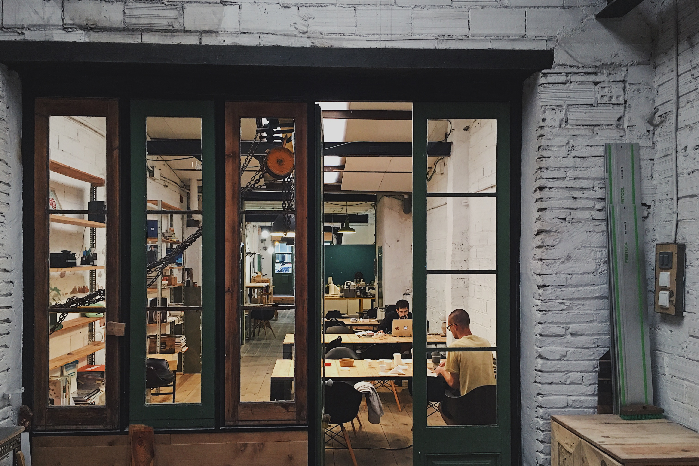
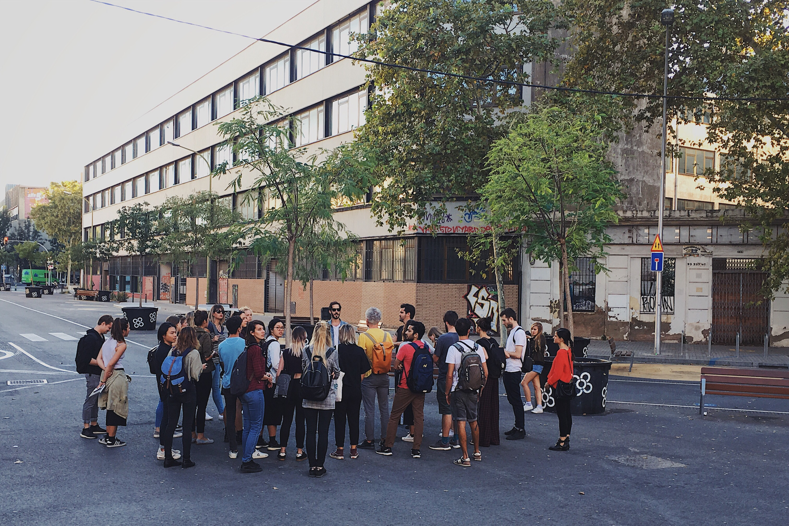

And so it begins. My journey at IAAC has officially started. The course kicked off with MDEF Bootcamp which provided us with a broad overview of the programme and served as a sort of cultural and visionary anchor of the Fab Lab and what it stands for. 

T first week's learning process was broken down into following areas:

- **Engage** - Engage with people around you and your immediate surroundings.
- **Question** - Question
- **Contradictions** 
- **Sharing**

## Grand visions

## Perils of open source publishing
Using GitLab

Barrier to entry for independent online publishing is still relatively high.

### Doing a workshop

## City safari in Poblenou
The group has done an organised tour of [Poblenou](https://en.wikipedia.org/wiki/El_Poblenou) and visited several interesting spaces that are based in the neighbourhood. The tour has reinforced my impression of Poblenou as a place with a high concentration of creatives, makers and innovators. You somehow tacitly feel the creative energy flowing in the air just by walking through the neighbourhood.

Unfortunately, many spaces seemed uninviting from the outside and felt isolated from the life on the street. One notable exception was [TransfoLAB](https://www.transfolabbcn.com/home) which is doing amazing work in raising awareness of the potential for repurposing and reusing objects that would normally be considered trash. It was the only innovative space that was visually and spatially organised in a way that invites a random passerby to come in and explore what is going on inside.

### Superblock version 0.1
The visit to the Barcelona's first ['superblock'](https://www.theguardian.com/cities/2016/may/17/superblocks-rescue-barcelona-spain-plan-give-streets-back-residents) was particularly interesting. While the promise of superblocks and its positive impact of the city's public life is clear, the execution seems to be lacking. There is still a demarcation between the sidewalk and the road and the entire space is dominated by bare concrete with. A feeble attempt to humanise the space was done by placing around a few plastic buckets with tiny trees and building a standard children's playground.

While I understand that such large-scale intervention requires time and resources, my concern is that the net effect may not be significant enough to merit the development of more superblocks around the city.

### Scavenging materials
When I heard that we will go around the neighbourhood I was quite excited. It ended up being even more exciting than I have expected. The exercise immediately makes a person engage with a city in a different way. Rather than just as provider of services and goods, the city has out of a sudden become a resource in itself. It was also a very tangible manifestation of how wasteful modern urban life style has become. We were able to collect a lot of quality material in a surprisingly short time. It was a fun and eye-opening experience.

## The Green Fab Lab

The impromptu visit to the [Green Fab Lab](http://greenfablab.org/) was the highlight of the week. The beautiful grounds and surroundings aside, the Green Fab Lab represents a serious commitment towards developing tools and methods for harmonious relationship between nature and technology. I was hoping that the house would be a bit further ahead in its pursuit of self-sufficiency

## Takeaways

Some of the passages presented here might have an overly critical undertone. The truth is that I have tremendously enjoyed every day of the bootcamp and that most cities of a similar scale pale in comparasence to Barcelona in terms of the quality of public spaces and civic life. 

A lot of ambition and idealism which I wholeheartedly support. Question of large-scale systemic change in culture and economic terms

The bootcamp has instilled some doubts in how I want to go about making my vision come true

I got an impression that FabLab is 

how is it relevant for me?

The bootcamp reassured me that I made a good decision by attending this course.

## Conclusion
Some of the passages presented here might have an overly critical undertone. The truth is that I have tremendously enjoyed every day of the bootcamp and that most cities of a similar scale pale in comparasence to Barcelona in terms of the quality of public spaces and civic life. 

### Links and resources

* [OSBeehives](https://www.osbeehives.com/)
* [The Century of the Self](https://topdocumentaryfilms.com/the-century-of-the-self/)
* more to be added soon