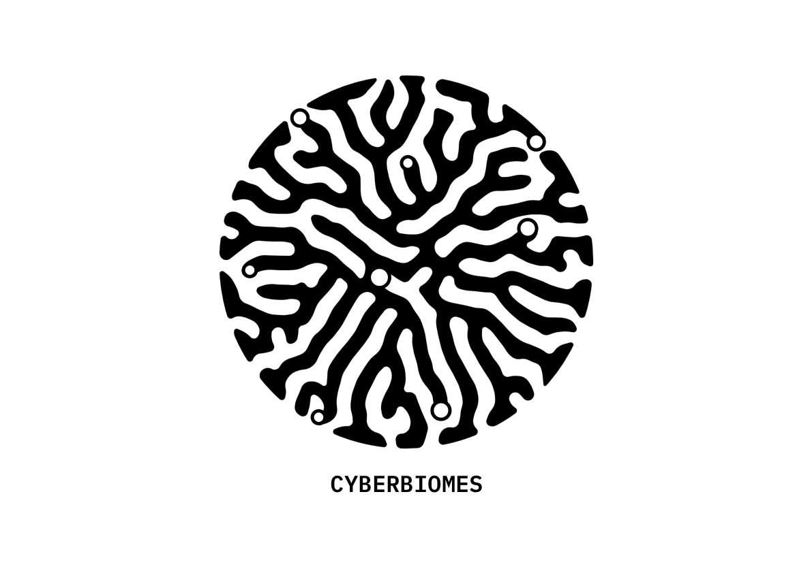

> _The planet is dying because we are satisfied with our limited relationships in which control, denial, and abuse are tolerated. The status quo is that we have these petty relationships with each other, between nations, with ourselves and the natural world. Why should we bother? Because healthy relationships are not an esoteric goal. It is a matter of our very survival and the survival of most of the life upon this earth._
>
> — O’Connor (1995)

## 1. Introduction

We have lost the primordial connection to our planet. We are bringing ourselves along with countless other species on a brink of extinction. We are in an abusive relationship with the mother Earth which is increasingly showing signs that it will not tolerate our destructive behaviour for much longer.

The unceasing barrage of scientific discoveries and technology have monopolised our perceptual field, making us blind to the ebbs and flows of the natural world that sustain us. To restore the lost connection, we need to completely re-conceptualise how we collectively relate and interact with our planet and the species we share it with.

This essay takes a phenomenological approach that is inherently rooted in the organic basis of our thoughts and our intelligence. It is an approach that has ‘most forcefully called into question the modern assumptions of a single, wholly determinable, objective reality’ in the recent Western philosophical tradition (Abram, 1997, p. 31).

Phenomenology does not attempt to describe the so-called objective reality but rather focuses on perception and our intersubjective experience in relation to other people, living organisms, things and our immediate surroundings. In that sense perception is seen as an ‘attunement or synchronization between my own rhythms and the rhythms of the things themselves, their own tones and textures.’ (Abram, 1997, p. 50)

More specifically, this essay strives to shed light on our perceptions of more-than-human entities, how they changed over the course of history and particularly how a collective shift in these perceptions is a prerequisite for saving ourselves and our planet.

Given the immense scale and depth of the subject matter, this essay focuses only on shifting socio-cultural patterns and attitudes towards the natural world. The necessary economic, political and environmental changes are not addressed in detail but are implied in the overall sentiment of the work presented here.

The first section explores the broader field of biosemiotics and indigenous ways of knowing as a lens for framing a new model for dealing with the ongoing environmental crisis. Then a brief introduction into mycelium as a potent perceptual medium is presented followed by a more speculative section looking into the solarpunk genre and the potential future protocols and human-planet interfaces that connect our being to that of Earth in synergetic and meaningful ways. The essay concludes with the presentation of a speculative artefact and closing remarks and reflections.

---

> _Western consciousness is by no means the only kind of consciousness there is; it is historically conditioned and geographically limited, and representative of only one part of mankind. This widening of consciousness ought not to proceed at the expense of the other kinds of consciousness._
>
> — Jung (2002)

## 2. Towards restorative biosemiotics

Biosemiotics is the study of signs, of communication, and of information exchange in terrestrial living organisms that goes beyond the constraints of spoken and written language. From the perspective of ecocritical biosemiotics language is about ‘how beings bring forth their lifeworlds […] in dynamic conjunction with the lifeworlds of other entities.’ (Gagliano, Ryan, & Vieira, 2017, p. xix)

Other related terms include ethnobotany, plant cognition, biocybernetics, biomimetics, or bioacoustics – just a fraction of a long list of loosely-related areas of studies investigating how the non-human organisms communicate among themselves and with each other.

In this essay, the biosemiotics are viewed in a broad sense as an ‘interchange of two languages: the biosemiotics of vegetal life and human signification.’ (Marder, 2017, p. 109). The synthesis presented here illustrates new epistemological approaches and ways of knowing that acknowledge the value of plural ontologies (Boehnert, 2019).

The dominant language systems have grammatically and syntactically deprived other-than-human beings of their animacy. Jung (2002) refers to these linguistic and perceptual limitations as the tyranny of words. We need to learn to navigate the bilingual world between the lexicon of science and what Kimmerer (2017) refers to as the grammar of animacy. Kimmerer (2017, p. 131) gives a poetic example from the language of Potawatomi, a Native American people from the Great Lakes region:

> _When bay is a noun, it is defined by humans, trapped between its shores and contained by the word. But the verb wiikegama—to be a bay—releases the water from bondage and lets it live. “To be a bay” holds the wonder that, for this moment, the living water has decided to shelter itself between these shores, conversing with cedar roots and a flock of baby mergansers. Because it could do otherwise—become a stream or an ocean or a waterfall, and there are verbs for that, too._

A closer look at indigenous cultures and their ancestral ontologies embedded within the natural landscape provides a potent lens for analysing how we might bridge this biosemiotic gap.

### Indigenous meets scientific

We have been conditioned to dismiss ancestral and indigenous ways of knowing as ‘primitive’ and based on imagination, rather than hard scientific truths. But we fail to realise that the modern civilisation is entirely based on myths and stories that we have constructed to make the organisation of large-scale populations easier, effective and arguably more oppressive.

In his first book Sapiens, a recently popularised historian Harari (2015) aptly describes this collective cognitive dissonance:

> _People easily understand that ‘primitives’ cement their social order by believing in ghosts and spirits, and gathering each full moon to dance together around the campfire. What we fail to appreciate is that our modern institutions function on exactly the same basis. Take for example the world of business corporations. Modern businesspeople and lawyers are, in fact, powerful sorcerers. The principal difference between them and tribal shamans is that modern lawyers tell far stranger tales._

A renowned 20th century cultural theorist Joseph Campbell, most known for his work in comparative mythology, argues that ‘our story of the Fall in the Garden sees nature as corrupt; and that myth corrupts the whole world for us’ which in his view results in ‘a totally different civilization and totally different way of living according to whether your myth presents nature as fallen or whether nature is in itself a manifestation of divinity.’ (Campbell & Moyers, 1991, p. 121)

This disconnect from nature is visible in our spiritually deprived Western culture that privileges objectified information and pays little to no attention to spiritual and emotional dimensions of life on Earth. We have much to learn from the indigenous ways of being in which boundaries between animals and the animate landscape are absent.

Robin Wall Kimmerer has written extensively about integrating our scientific ecological knowledge (SEK) with that of traditional ecological knowledge (TEK), which ‘refers to the knowledge, practices, and beliefs about the relationship of living beings to one another and to the physical environment that are held by peoples in relatively nontechnological societies with a direct dependence on local resources’. (Kimmerer, 2011, p. 265)

TEK has been marginalised by the scientific community despite the fact that the United Nations Environment Programme (1998) has recognised it as having equal status with scientific knowledge. (Kimmerer, 2011) But recent cultural trends and an opening up of new frontiers of scientific inquiry suggest that we are slowly recognising perceptual limitations of our dominant ontological structures.

> _Modern scientific knowledge, with its accompanying world view of humans as being apart from and above the natural world has been extraordinarily successful in furthering human understanding and manipulation of simpler systems. However, neither this world view nor scientific knowledge have been particularly successful when confronted with complex ecological systems. These complex systems vary greatly on spatial and temporal scales rendering the generalizations that positivistic science has come up with of little value in furnishing practical prescriptions for sustainable resource use […]. Science-based societies have tended to overuse and simplify such complex ecological systems, resulting in a whole series of problems of resource exhaustion and environmental degradation._

### Exploring the limits of consciousness

When it comes to a spiritual connection to nature and planet Earth, the psychedelics are the obvious elephant in the room. Unfortunately, the term carries significant conceptual and semantic baggage carried over from the rise of the counterculture in the 1960s and subsequent reactionary handling of the situation that has all but shut down any serious inquiry into the potential of these compounds for purposes of Gaian healing and uncovering the secrets of consciousness.

Our current civilisation associates altered states of consciousness induced by psychedelics primarily with entertainment and hedonistic pursuits. However, humans have been using naturally occurring psycho-active plants and compounds for most of the history of our species in a ritual and highly spiritual context. There is actually not a culture on earth ‘that doesn’t make use of certain plants to change the contents of the mind, whether as a matter of healing, habit, or spiritual practice.’ (Pollan, 2018, p. 13).

Archaeological evidence shows us that virtually all the previous civilisations had a mystical relationship with psychoactive plants to a greater or lesser extent, including the Dionysian mysteries in ancient Greece and Rome. It was with the phasing out of pagan traditions and the rise of organised, mostly monotheistic, religions that use of mind-altering plants has increasingly become taboo in the wider society.

There is little doubt that use of these chemicals to alter the states of perception have significantly contributed to early humans’ keen interest in nature of being and fostered a deeper spiritual connection to the local flora and fauna. Which brings us to the ‘the epitome of all mycocentric speculation’ – the ‘stoned ape’ hypothesis from a cultural theorist and late 20th-century psychedelics evangelist Terence McKenna (Pollan, 2018, p. 115).
McKenna (1996, p. 24) went as far as to suggest that the rapid acceleration in the development of human consciousness and symbolic language was caused by the increased sensory acuity and a sense of wonder induced by ingesting plants containing psychoactive compounds:

> _My contention is that mutation-causing, psychoactive chemical compounds in the early human diet directly influenced the rapid reorganization of the brain’s information-processing capacities. Alkaloids in plants […] could be the chemical factors in the protohuman diet that catalyzed the emergence of human self-reflection. The action of hallucinogens present in many common plants enhanced our information-processing activity, or environmental sensitivity, and thus contributed to the sudden expansion of the human brain size. At a later stage in this same process, hallucinogens acted as catalysts in the development of imagination, fueling the creation of internal stratagems and hopes that may well have synergized the emergence of language and religion._

Because consumption of psilocybin mushrooms by early hominids would not leave any fossil record, McKenna’s hypothesis is not really susceptible to proof or disproof (Pollan, 2018, p. 116). More than a theory of biological evolution, it is a theory of cultural evolution based on a relatively commonsensical assumption that our ancestors have likely experimented and co-evolved with psychoactive plants that grow widely across the entire planet and that have been living on the face of the Earth long before our species even appeared on the scene.

The Western ontological dogma associates consciousness primarily with humans and in rare cases with certain animal classes. From this perspective, the locus of thought and imagination originates in the brain organ. However, there is a growing number of theories, that fall under the philosophical view of panpsychism, suggesting an existence of a proto-consciousness as a ubiquitous property of the universe. The socio-cultural theories of distributed consciousness are gradually being corroborated with findings from quantum-relativistic physics which increasingly lend support to formerly esoteric ideas such as the existence of infinite timeliness and parallel universes.

The resurgence of medical research into psychedelics, recent efforts to decriminalise naturally occurring psychedelic substances in the US (Voytko, 2019) as well as growing cultural acceptance suggest that we starting to explore ‘other modes consciousness that might offer us specific benefits, whether therapeutic, spiritual, or creative.’ (Pollan, 2018, p. 16)

A radically biosemiotic perspective suggests that the primordial vegetal and mycelial organisms contain ancient knowledge that can be accessed through different means, psychedelics being only one of them. Other ancient forms of inducing non-ordinary states of consciousness include meditation, yoga, systemic breath work, rhythmic dance, music, or fasting. Shamans and seers have historically functioned as cultural architects whose role was to be the bonding medium between human and more-than-human worlds.

Traditionally shaman ’acts as an intermediary between the human community and the larger ecological field, ensuring that there is an appropriate flow of nourishment, not just from the landscape to the human inhabitants, but from the human community back to the local earth.’ (Abram, 1997, p. 7)

In our contemporary culture, shamans have been replaced with a techno-utopian breed of mostly Silicon Valley technologist born out of the psychedelics-infused era of early stages of personal computing. (Rushkoff, 2002) This generation of IT visionaries embodied the hacker ethos and shared a vision of open Internet controlled by the people using it. However, after the Dot-com bubble burst at the turn of the millennium, the idealism and utopian inclinations have been replaced with a ruthless economic drive for optimisation and creation of an unprecedented surveillance assemblage fuelled by venture capital and corporate interests.

Silicon Valley has retained its positive attitude towards mind-altering substances, however, the psychedelics are increasingly seen as productivity enhancers and mood boosters, particularly in the form of so-called micro-dosing. It is debatable whether such narrowly focused use diminishes spiritual and biosemiotics potential of these substances, nevertheless it is important to explore the trends and attitudes towards altered states of consciousness in Silicon Valley. After all, they are the people who are designing and building our modern day immersive devices that serve as prosthetics that allow us to transcend time and space – in some sense, it can be argued that our current technology is the most potent psychedelic humanity has ever encountered.

Can we bridge the gap and merge these technologically induced psychedelic states with the ancient lifeworld originating from nature?

### From Anthropocene to Ecocene

Earliest mentions of _Anthropocene_ date to mid-1970s (Steffen, Grinevald, Crutzen, & McNeill, 2011), but it is only since about the time of Paris Agreement in 2016 that the term has gained a more official standing in the public and scientific discourse. In a purely rational sense, the term is an apt designation for our geographical epoch in which human species and their activity are the main driving forces shaping the face of planet Earth today.
However, as a narrative tool, the term Anthropocene conveys elusive doomsdays overtones that evoke the feeling of a self-fulfilling prophecy and inevitability of the collapse of our civilisation through the obliteration of our home planet. We need a different, more constructive and pro-active framing, one that imagines and works towards preferable futures. Boehnert (2019) suggests we instead conceptualise our epoch through a lens of Ecocene that ‘challenges anthropocentric modes of domination that arise from reductive and extractive ontologies.’ (Boehnert, 2019, p. 3).

Ecocene strives towards regenerative design economies centred around ‘ecologically literate perspectives that foreground nature’s regenerative capacities.’ (Boehnert, 2019, p. 3) Rather than extraction and exploitation, it is a philosophy based on a relation of reciprocity and mutual symbiosis. It is a design that ‘mimics the processes of nature to increase diversity, modularity, tightness of feedbacks, increasing redundancy, mutually supportive networks, self-regulation based on information and resource exchange within nested networks, the sharing of abundance.’ (Boehnert, 2019, p. 9)

On a more personal level, we need to revivify the ancient appreciation for the wonders of nature and become more attentive to the perceptual and biosemiotics dimension of the life on planet Earth — we are long overdue for a new environmental ethic as eloquently described by Abram (1997, p. 69):

> _It may be that the new “environmental ethic” toward which so many environmental philosophers aspire—an ethic that would lead us to respect and heed not only the lives of our fellow humans but also the life and well-being of the rest of nature—will come into existence not primarily through the logical elucidation of new philosophical principles and legislative strictures, but through a renewed attentiveness to this perceptual dimension that underlies all our logics, through a rejuvenation of our carnal, sensorial empathy with the living land that sustains us._

---

> _I see the mycelium as the Earth’s natural Internet, a consciousness with which we might be able to communicate. Through cross-species interfacing, we may one day exchange information with these sentient cellular networks. Because these externalized neurological nets sense any impression upon them, from footsteps to falling tree branches, they could relay enormous amounts of data regarding the movements of all organisms through the landscape._
>
> — (Stamets, 2005)

## 3. Mycelial link

Mycelium is such a peculiar organism and potentially far-reaching medium of the near-future that it deserves a section of its own. Mycelium defies standard biological categorisation; taxonomically it is considered a kingdom of its own but on a pragmatic level it is a cross-species hybrid. Animals are more closely related to fungi than to any other kingdom. Evolutionary speaking we are descendants of fungi. (Stamets, 2005, p. 2) We are indeed similar on a cellular level, as we both exhale CO2 and inhale O2. Taking to its logical conclusion, we are fungal bodies, we are mushrooms.

Mycelial architecture is remarkably adaptive with only one cell wall thick and its evolutionary strategy is based on direct and intimate contact with every organism it encounters. From this perspective, mycelium can be viewed as a meta-organism of sorts – a highly distributed and intelligent being that symbiotically extends itself by facilitating synergetic connections between itself and other species.

Furthermore, the oldest multicellular organism in the fossil record today is a fungus, making mycelium one of the oldest organisms inhabiting our planet. The largest single living organisms on the planet is also a fungus in Easter Oregon, covering an area over 8.8 km2. These ancient beings are great at responding to catastrophes, they evolved to do that after surviving all the mass extinctions and cataclysmic events in the history of our planet. Through a combination of biotechnology and spiritual awakening, we may be able to tap into this ancestral knowledge and respond effectively to our impending planetary catastrophe.

Mycelium infuses a habitat with information-sharing membranes that allow other species to communicate and to exchange valuable information and nutrients through the vast network of mycelial neural nodes. Sometimes referred to as the ‘wood wide web’, mycelium serves as an underlying structural and informational hub for entire ecosystems, allowing plants, trees and microbes to communicate over distances. Its architecture resembles that of our world wide web as well as patterns predicted in string theory.

Fungi can also survive in outer space making them of the chief candidates for the panspermia hypothesis which argues that life on Earth originated from a life-form that arrived at our planet through ‘interstellar protobiological migration’. (Stamets, 2005, p. 9) The mycelial archetype seems to permeate all aspects of life on Earth and potentially outer space as well. It is the ultimate biosemiotic interface that potentially offers answers for many of the most pressing environmental issues facing our planet today. Going back to the stoned ape hypothesis presented earlier, fungi may also help us shed light on the nature of consciousness.

Through the process of remediation, mycelium can transform various toxins into nutrients that can enter back into the circulation – including such compounds as plastic or crude oil. Certain mushrooms have medicinal properties that can benefit both humans and non-humans alike – they can be particularly helpful in curtailing the decreasing populations of bees and other insects that are indispensable for the production of food and overall balance of our biomes.
Mycelium and mycotechnologies can also function as a universal building block in fields of architecture, industrial design, agriculture, energy, manufacturing and virtually any area of both human and more-than-human endeavour.

Thanks to the myco-evangelist and active promoter of fungal ways of knowing Paul Stamets, there is an increasing interest mycelium in the wider mainstream discourse. By opening up these discussions and further disseminating and promoting the mycelial knowledge we may well put our species on the path towards regenerative planetary healing.

---

> _[I]t is now highly feasible to take care of everybody on Earth at a “higher standard of living than any have ever known.” It no longer has to be you or me. Selfishness is unnecessary and hence-forth unrationalizable as mandated by survival. War is obsolete. [It is a matter of persuading] all humanity to divert high-science technology from weaponry to livingry._
>
> — Fuller (1981)

## 4. Solarpunk futures

The term _solarpunk_ seems to have first appeared on the blog Republic of the Bees in 2008 (Springett, 2017). However, most sources refer to a Tumblr post from Olivia Louise from 2014 as the moment when online discussions about solarpunk started to pick up steam and create a community (Louise, 2014). A sci-fi writer Alia Gee claims that her husband has come up with the term in the early 2010 (Watson, 2015). It is likely that multiple people have came up with the term independently of each other. Born in small online pockets, it is clear that solarpunk defies any formal definitions or precise categorisation.

Broadly speaking, solarpunk is an eco-futurist movement that draws significantly from the philosophy of social ecology. It is often referred to as a particular type of sci-fi genre but at the moment it is ‘more a political imagining, or a statement of intent than a concrete body of work.’ (Valentine, 2015). Based on personal investigation, solarpunk seems to be primarily an online-based movement born as a response to the structural pessimism portrayed by dystopian cyberpunk imagery. According to Valentine (2015):

> _In the West, we’ve grown so comfortable with consuming that there is a failure to even imagine what our lives might look like in a carbon-neutral society. It’s easier for us to imagine a reset-button; a collapse, a major natural disaster, or great die-offs than a stable transition to sustainability._

Solarpunk has ‘the artistic and literary power to push beyond our cultural doomsday mindspeak and make us believe in the future again.’ (Valentine, 2015). What makes the idea of solarpunk so potent is that it works from our existing technologies based on things we already know are possible. Solarpunk futures envision a world of distributed clean energy, available and benefiting everyone in a society that functions more like an ecology – non-hierarchical, cooperative, diverse, and seeking balance. (Owens, 2016) Its imagery is one of Art Nouveau aesthetics with lush green urban areas fully immersed in symbiotic relationship with the surrounding landscape and the planet as a whole.

> _It’s a world of decentralised and confederated eco-communities, using technology for human-centric and eco-centric ends rather than for accumulating power and profit – mending the metabolic rift between first nature (the natural world) and second nature (human culture) – and where social hierarchies of race, gender, sexuality, and disability are considered horror stories from the past “oil age”._ (Owens, 2018)

Using eco-speculative ideals and organic aesthetics of Solarpunk as a conceptual lens, following are examples of imaginary biosemiotic technologies that are feasible in the 21st century.

#### meta-mycelium

Mycelium as a biosemiotic meta-material that binds all the living organisms into a global information exchange network. Myconeurological sensor for monitoring and responding to environmental data in real-time. Fungi as nano-conductors in mycocomputers that perform computationally intense task via a distributed network spanning the entire planet. Myco-beacons on trees and plants in cities that allow them to communicate and exchange nutrients just like they would in the forest using a sort of hybridised mycelium embedded in our wireless technology. Besides the conscious link, we may be able to physiologically tap directly into the mycelial networks and join on the biome-wide conversations, trade nutrients and packets of information and know-how with other species.

#### biotic smart contracting

Real-time smart contracting with plants and other species in both the local biome and global meta-biome. Plants could use this biotic network to organise collective inter-species action and raise issues they find relevant – i.e. trees in a city could file a petition to sue their local government for not taking necessary precautions to tackle pollution and ensure biodiversity in their local biome. Plants and other non-human species could gain political and economical agency and the network would ensure they are appropriately reimbursed for their contribution to the common good by producing oxygen and harvest.

#### botanical engineering and interfacing

Plants as biotic measuring devices would provide direct access to raw environmental data, as opposed to proxies provided by traditional semiconductors. Plants could be engineered and breed so they produce mechanical parts or provide architectural and logistical infrastructure for cities.

#### cyber botany

Enhancing plants with robotic prosthetics that would allow them to overcome spatiotemporal limitations of their organic bodies and mover around freely in search for nourishment and interactions with other beings.

---

## 5. The world’s first (mini) cyberbiome

The problems discussed in the previous sections cannot be addressed with a particular technology or design solution. Therefore, I have framed my intervention as a platform for promoting biosemiotic literacy and dissemination of reference materials, resources and projects that are paving the way towards regenerative futures in full symbiosis with the planet Earth – an inter-species school of thought for the 21st century.

The main goal of the project presented here is to foster a perception of non-human living organisms not just as sentient beings but as part a broader field of cosmic proto-consciousness. To that end, I have aimed to develop well-rounded and inspirational artefacts that strive to induce a sense of wonder and curiosity towards natural and more-than-human entities.

The project consisted of two main design actions. First involved designing and building a space for biosemiotic contemplation in a form on an immersive installation accompanied by a selection of floating posters with obscure terms and their definitions. The focal point of the exhibit is an organically shaped platform filled with soil and two plants. Using projection mapping, the installation alters the perception of plant communication by visualising a faux-mycelial network in which particles are floating between the two plants, simulating an information exchange. Once a participant approaches the platform and puts their hands on top of the soil particles start floating between them and the plants; making the participant feel like they have become a part of the mycelial network. The overarching aim of the installation is to generate a sense of intrigue and wonder in participants – enough for them to take their phones out and investigate the presented concepts and ideas further.

The second action consisted of designing and developing an online platform for curating and synthesising resources and references from a variety of fields loosely related to biosemiotics. The intention is to regularly update the site, as well as generate outreach through social media channels. The site aims to be an authoritative repository of biosemiotic fields of inquiry, innovations and artefacts – presenting visitors with a plethora of tools and methods for imagining positive futures in a symbiotic relationship with planet Earth. The website is available at [https://cyberbiomes.org](cyberbiomes.org).

Given the project’s long-term ambitions the naming was important. It needed to be something that is in line with the overall biosemiotic philosophy presented here while appearing somehow seamless, as something that has always existed, a dictionary entry of sorts.

The term _cyberbiomes_ came about spontaneously on the spur-of-the-moment late one night. The idea was to incorporate a cybernetic element into an existing ecological entity that is generalisable and large enough to accommodate every possible species in any geographical area while being respectful of its natural boundaries. The cybernetic aspect of the name eludes to the role technology plays in the creation of new forms of inter-species interfacing. Semantically, the term suggests the primacy of the biome in which technology follows and builds around the natural, rather than the other way around.

I have loosely defined cyberbiomes as:

_hybrid spaces for facilitating synergetic dynamics between people, machines and non-human living organisms through the use of novel modes of inter-species interactions and planetary interfaces_

While I’m not entirely satisfied with this initial definition, it manages to convey the core values and ideals in a relatively succinct, but arguably dense, manner.

Later, I have considered re-naming the project to cybergardens which has a more friendly tone and may appear more accessible to the general public. However, after some thought, I have concluded that gardens are groomed man-made spaces and are also quite limited in the scope and variety of species they allow to co-exist together. I have therefore decided to stick to the more academic-sounding, but conceptually sound variant.

---

## 6. Reflection

Working on this project has exposed me to many rather obscure concepts and out-of-ordinary ways of knowing that I was not aware off before. I found it to be a valuable experience that gas given me enough research material for a long time to come. Maybe more importantly, it has notably improved my sense of wonder and curiosity towards ecological systems and its vegetal and fungal constitutes.

Initially, I was skeptical of taking a more artistic and speculative approach, but it turned out to be an ideal fit for my project as it allowed me to play with different methods and tools without constraining myself to certain pragmatic outcomes.

Overall, it was a genuinely fulfilling and inspiring experience that has generated enough momentum to keep me working on the platform and the project in the future as well.

---

## Bibliography

Abram, D. (1997). The Spell of the Sensuous: Perception and Language in a More-Than-Human World. New York: Vintage Books.

Boehnert, J. (2019). Ecocene Design Economies: Three Ecologies of Systems Transitions. The Design Journal, 22(sup1), 1735–1745. https://doi.org/10.1080/14606925.2019.1595005

Campbell, J., & Moyers, B. D. (1991). The Power of Myth (1st Anchor Books ed). New York: Anchor Books.

Fuller, B. R. (1981). Critical Path. New York, N.Y: St. Martin’s Press.

Gagliano, M., Ryan, J., & Vieira, P. I. (Eds.). (2017). The Language of Plants: Science, Philosophy, Literature. Minneapolis: University of Minnesota Press.

Harari, Y. N. (2015). Sapiens: A Brief History of Humankind (1st edition). New York: Harper.

Jung, C. G. (2002). The Earth Has a Soul: The Nature Writings of C.G. Jung. (M. Sabini, Ed.). Berkeley, Calif: North Atlantic Books.

Kimmerer, R. (2011). Restoration and Reciprocity: The Contributions of Traditional Ecological Knowledge. In D. Egan, E. E. Hjerpe, & J. Abrams (Eds.), Human Dimensions of Ecological Restoration (pp. 257–276). Washington, DC: Island Press/Center for Resource Economics. https://doi.org/10.5822/978-1-61091-039-2_18

Kimmerer, R. W. (2017). Learning the Grammar of Animacy. Anthropology of Consciousness, 28(2), 128–134. https://doi.org/10.1111/anoc.12081

Louise, O. (2014). Land of Masks and Jewels. Land of Masks and Jewels. https://missolivialouise.tumblr.com/post/94374063675/heres-a-thing-ive-had-around-in-my-head-for-a.

Marder, M. (2017). To Hear Plants Speak. In M. Gagliano, J. Ryan, & P. I. Vieira (Eds.), The Language of Plants: Science, Philosophy, Literature. Minneapolis: University of Minnesota Press.

McKenna, T. (1996). Food of the gods: The search for the original tree of knowledge : A radical history of plants, drugs and human evolution. New York: Bantam.

O’Connor, T. (1995). Therapy for a Dying Planet. In T. Roszak, M. E. Gomes, & A. D. Kanner (Eds.), Ecopsychology: Restoring the earth, healing the mind (pp. 149–155). Berkeley, California: Counterpoint.

Owens, C. (2016). What is Solarpunk? Solarpunk Anarchist.

Owens, C. (2018). Solarpunk as Anarchist Infrapolitics. Solarpunk Anarchist.

Pollan, M. (2018). How To Change Your Mind: The New Science of Psychedelics.

Rushkoff, D. (2002). Cyberia: Life in the Trenches of Cyberspace. Manchester: Clinamen Press.

Springett, J. (2017). SOLARPUNK : A REFERENCE GUIDE. Solarpunks.

Stamets, P. (2005). Mycelium Running: How Mushrooms Can Help Save the World. Berkeley: Ten Speed Press.

Steffen, W., Grinevald, J., Crutzen, P., & McNeill, J. (2011). The Anthropocene: Conceptual and historical perspectives. Philosophical Transactions of the Royal Society A: Mathematical, Physical and Engineering Sciences, 369(1938), 842–867. https://doi.org/10.1098/rsta.2010.0327

Valentine, B. (2015). Solarpunk wants to save the world. Hopes&Fears. http://www.hopesandfears.com/hopes/city/life/215749-solarpunk.

Voytko, L. (2019). Efforts To Decriminalize Magic Mushrooms Beginning To Sprout Nationally. Forbes. https://www.forbes.com/sites/lisettevoytko/2019/06/14/efforts-to-decriminalize-magic-mushrooms-beginning-to-sprout-nationally/.

Watson, A. (2015). Interview Part 2: Alia Gee on the New Sub-Genre Solarpunk. Carbon Culture.
