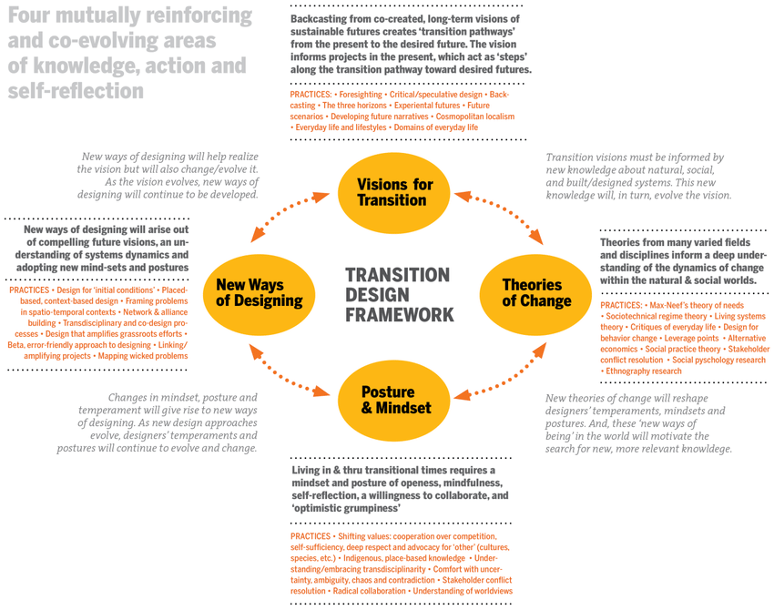
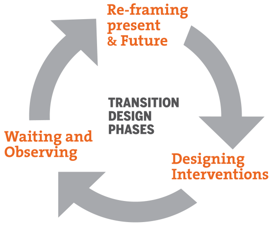
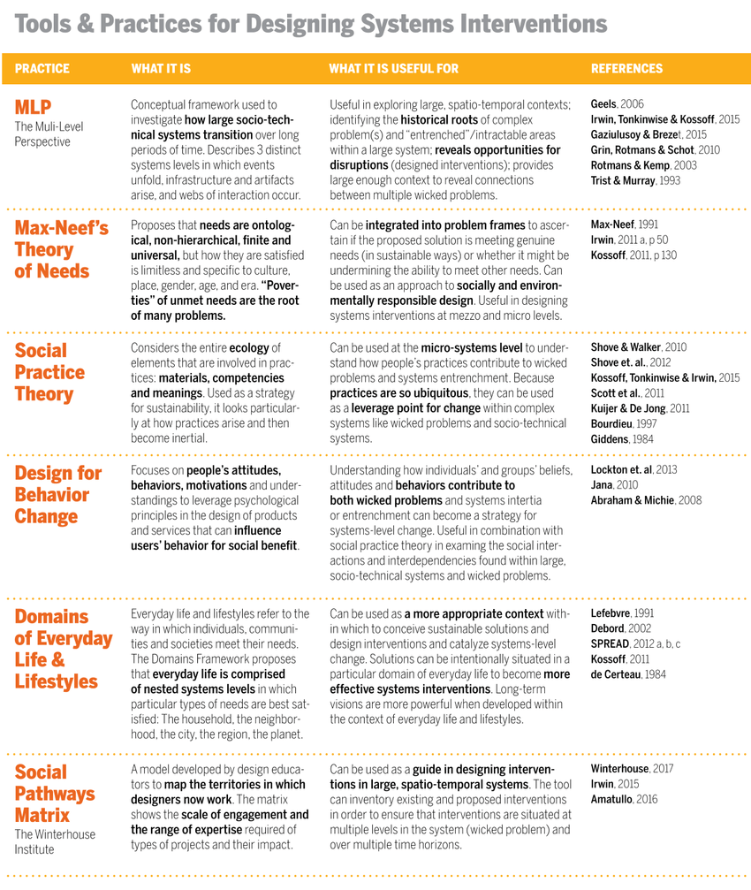

# Design for the New

This essay analyses and comments on Transition Design (TD) approach as proposed by Irwin Terry in her 2018 conference paper entitled *The Emerging Transition Design Approach*. The paper presents an approach that seeks to address the so-called ‘wicked’ problems – such as climate change, inequality, pollution, loss of biodiversity - in an attempt to ‘seed and catalyse societal transitions toward more sustainable and desirable long-term futures.‘ (Terry, 2018, p. 1)

Traditional problem-solving approaches are not suitable for addressing wicked problems which have a high degree of social complexity and are hard to isolate in the context of complex systems.

The author argues that fields such as service design, experience design, meta-design or sustainable design have broaden the scope of traditional design to take a more systemic view when addressing complex problems. However, they ‘still tend to frame problems within relatively narrow spatio-temporal contexts and do not offer a comprehensive approach for identifying all stakeholders and addressing their conflicts.’ (Terry, 2018, p. 2)

The author believes that the existing ways of addressing systemic issues fail to sufficiently analyse and uncover tacit beliefs, assumptions, norms and motivations of all the stakeholders. These often ineffable factors obfuscate layers of social hierarchies and inequalities that have contributed to the problem.

Terry proposes a *Transition Design Framework* (TDF) which, rather then being a static linear process, strives to synthesise different set of evolving practices for change at the system level. Compared to contemporary design practice, it frames problems within radically large spatio-temporal contexts and tries to gain a deeper socio-technical understanding of all the stakeholders, as well as addressing their conflicts, which many design approaches tend to overlook.

## Transition Design Framework

Rather than being a framework per se, TDF is a heuristic tool that provides conceptual and logical basis for synthesising a variety of practices ‘situated within four mutually-influencing, co-evolving areas that are relevant to seeding and catalysing systems-level change.’ (p. 5)

The four co-dependent areas of TDF are:
- Vision for Transition – visions for creating ‘transition pathways’ which inform projects in the present and act as steps on the way towards desired futures.
- Theories of Change – a need to integrate knowledge and methodologies from a variety of fields in order to analyse and explain the dynamics of change in complex systems.
- Posture & Mindset – a call for a particular kind of mindset and posture that is required to bring upon positive change; it is a mindset of openness, mindfulness and willingness to collaborate.
- New Ways of Designing – will arise out of synthesising knowledge gained from in the other three areas.

Transition Design Framework can be used to:
 1. visualize and “map” complex problems and their interconnections and interdependencies;
2. situate them within large, spatio-temporal contexts;
3. identify and bridge stakeholder conflicts and leverage alignments;
4. facilitate stakeholders in the co-creation of visions of desirable futures;
5. identify leverage points in the large problem system in which to situate design interventions.

## The Transition Design Phased Approach

Practices from TDF can be applied within three phases. Rather than representing a linear process, these phases suggest types of actions and are mutually reinforcing and can be re-iterated as new knowledge is gained. They are also broad enough to accommodate a variety of practices and processes.

The three phases are:
1. Reframing: The Present and Future
2. Designing Interventions
3. Waiting and Observing

### 1. Reframing: The Present and Future

Each stakeholder affected by a wicked problem brings their own visions and cognitive models that are products of lifetimes worth of social conditioning and personal history. Therefore, each group of stakeholders has a limited understanding of the problem. This phase is meant to mitigate those effects and put all the stakeholders on the same page by changing the collective frame of looking at the problem.

The reframing phase can be split into several activities and steps.

***Mapping the Problem in the Present*** – In this step different groups of stakeholders collaborate to visually map the wicked problem. The focus is on uncovering and identifying as relationships as possible. The overarching goal is to transcend differences and enable all the stakeholders to achieve a shared definition of the problem. This provides them with understanding and appreciation of the complexities of the problem and of different perspectives – it creates a collective frame for looking at the wicked problem. The output of this activity is a visual artefact (problem map) that can be continuously updated and corroborated through subsequent research and feedback.

***Mapping Stakeholder Concerns & Relations*** – This step aims to get a full picture of stakeholder concerns, fears, hopes and desires related to the problem. The existing methods from other fields  – such as Needs-Fears Mapping, Conflict Analysis Tools or Multi-Stakeholder Processes – lack a pragmatic design-led component that results in tangible action and material results. TDF ‘aspires to integrate these stakeholder conflict resolution methods as a strategy for addressing wicked problems.’ (p. 8) An important component of this step is to provide collaborative activities for resolving conflicts and facilitating more meaningful understanding between different stakeholder groups.

***Future Visioning*** – Drawing from a range of foresighting techniques, this step enables ‘stakeholders to co-create compelling visions of long-term, lifestyle-based futures in which the problem has been resolved and many stakeholder fears/concerns addressed and hopes/desires fulfilled.’ (p. 9) Rather then envisioning reductionist discipline-based solutions, the focus is on re-envisioning entire lifestyles through narrative-building exercises such as ‘day-in-the-life’. This step aims to produce knowledge base and artefacts that will serve as a guiding compass for designing interventions in the present.’

***Backcasting*** – A method in which the first step is to imagine a desirable future and then ‘backcasting’ to the present. This creates so-called ‘transition pathways’ along which projects can be aligned at different stages in a longer transition. It takes an opposite approach from the overly deterministic forecasting. Rather than working from current trends into the future, it attempts to ‘define preferable futures, analyse their consequences, and determine the conditions necessary for them to materialize.’ (p. 11) 

### 2. Designing Interventions

Here, the problem map and future vision generated in the previous phase are situated within a large spatiotemporal context. It uses tools and approaches from TDF to ‘to develop interventions for problem resolution and systems transition.’ (p. 13) Compared to the traditional approaches which aim for swift, short-term, profitable solutions, transition design argues that wicked problems require a plethora of interventions at multiple levels operating over long periods of time.

 to situate both the wicked problem and a future, lifestyle-based vision in a large, spatio-temporal context. This large context is explored in order to identify the most promising points of intervention lie within this large context. Source: T. Irwin.")

This phases involves all spatio-temporal directions by ‘looking up and down systems levels in space, and backward and forward in time in order to contextualize and address wicked problems.’ (p. 14) The historical roots and causes of wicked problems are important for understanding present-day ramifications and consequences and for informing future design interventions.

The author offers a useful collection of methods and practices for designing system interventions:

### 3. Waiting and Observing

Transition design interventions operate on long timescales within a slow moving systems, so the process will involve periods of high activity and periods of observation, contemplation and reflection aimed at understanding how ‘the system has responded to the perturbation.’ (p. 16) 

Due to emergent behaviour in complex systems and self-organizing and self-determined characteristics of its agents, it is not possible to predict how will they respond to perturbations. The context for the intervention — set in social organisations and socio-technical systems — will ‘rarely respond to an intervention the way we think it will.’ (p. 16)

The approach presented here is in direct opposition to our obsession for fast-paced innovation and efficiency. It suggests a form of slow knowledge generation which Terry (2018) compares to Chinese acupuncture in which ‘an acupuncturist will closely observe the patient for a period of time in order to understand the imbalances or blocks in the system (body) and then place needles along specific meridians in order to shift energy.’ (p. 16) This is the posture and mindset part of TDF.

## Conclusions

The presented approach is an ambitious attempt to develop an all-encompassing design framework (or heuristic model) for addressing wicked problems. It integrates inclusive values and co-creative aspirations that are worthy of praise. However, it feels rather too fuzzy and abstract when set against the hard day-to-day realities of our times.

The wicked problems we are facing transcend any given group or nation. We do not need new solutions, they are already out there and have been for quite some time in certain areas of human endeavour. What we lack is political and cultural will to implement these solutions on a planetary scale. In this context, TDF seems more a like a marketable workshop model for boutique design agencies and their clients, rather than a pragmatic call-to-action that humanity could collectively follow.

## References

Irwin, T. (2018). The Emerging Transition Design Approach. Presented at the Design Research Society Conference 2018. https://doi.org/10.21606/drs.2018.210
