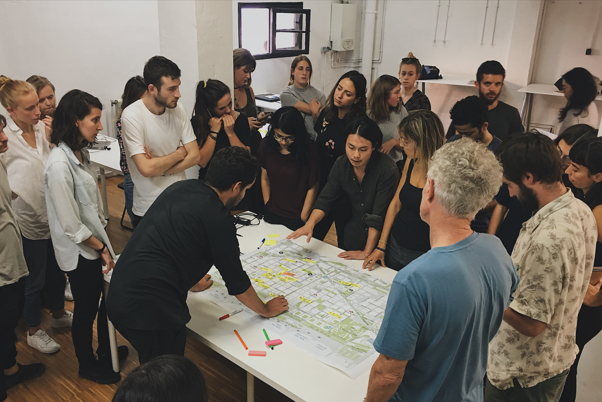

And so it begins. My journey at IAAC has officially started. The course kicked off with MDEF Bootcamp which provided us with a broad overview of the programme and served as a sort of cultural and visionary anchor of the Fab Lab and what it stands for.

## Stimulating environment
IAAC and the Fab Lab have a strong vision for the future of human existence on Earth. It is a vision that is aligned with many of the values that I hold close to my heart.

The communication and interaction with the group has been tremendous so far. It was inspiring to see people coming from a wide range of fields and backgrounds. The group seem to hold different ideas and opinions but everyone is united around the ideal of making the Earth a better and more liveable place.

## Perils of open source publishing
I love the idea of documenting our work on weekly basis and making it immediately available online. As a web developer it was easy setting up GitLab but many of my classmates had troubles getting used to the particularities of a Git workflow. I know it took me a couple of years to learn it enough for it to become an efficient and enjoyable tool. It also made me realise that even today the barrier to entry for independent online publishing is still high.

I was happy to hold a workshop and explain some of the principles of Git in more depth to the rest of the group. It was a good exercise in communicating knowledge and it was met with a positive feedback. I hope to organise more such workshops in the near future, focusing on personalising websites and creating a simple personal webpage from scratch using open-source tools.

## City safari in Poblenou
The group has done an organised tour of [Poblenou][1] and visited several interesting spaces that are based in the neighbourhood. The tour has reinforced my impression of Poblenou as a place with a high concentration of creatives, makers and innovators. You somehow tacitly feel the creative energy flowing in the air just by walking through the neighbourhood.

Unfortunately, many spaces seemed uninviting from the outside and felt isolated from the life on the street. One notable exception was [TransfoLAB][2] which is doing amazing work in raising awareness of the potential for repurposing and reusing objects that would normally be considered trash. It was the only innovative space that was visually and spatially organised in a way that invites a random passerby to come in and explore what is going on inside.

")

### Superblock version 0.1
The visit to the Barcelona's first ['superblock'][3] was particularly interesting. While the promise of superblocks and its positive impact of the city's public life is clear, the execution seems to be lacking. The entire space is dominated by bare concrete and overall lack of character. A feeble attempt to humanise the space was done by placing around a few plastic buckets with tiny trees and building a standardised children's playground.

It is surprising because Barcelona is known for being good at creating vibrant public spaces. While I understand that such large-scale intervention requires time and resources, my concern is that the net effect may not be significant enough to merit the development of more superblocks throughout the city.

### Scavenging materials
Going around the neighbourhood collecting material ended up being way more exciting than I have expected. The exercise immediately makes a person engage with a city in a different way. Rather than just as one-way provider of services and goods, the city has out of a sudden become a dynamic resource in itself. It was also a very tangible manifestation of how wasteful modern urban life-style has become. We were able to collect a lot of quality material in a surprisingly short time. There has not been a day since that I have not spotted useful material on the street. It was a fun and eye-opening experience.

## The Green Fab Lab
The impromptu visit to the [Green Fab Lab][4] was the highlight of the week. The beautiful grounds and surroundings aside, the Green Fab Lab represents a serious commitment towards developing tools and methods for harmonious relationship between nature and technology. I was hoping that the house would be a bit further ahead in its pursuit of self-sufficiency, but the project is still in its infancy and I expect it to develop in the coming years. A few solar panels would be a solid a start.

## Takeaways
The bootcamp has made me question some of my previous assumptions about what constitutes urban innovation and overall trajectory of the spaceship Earth. There seems to be a lot of idealism and good faith in the space but the questions of large-scale systemic and cultural change remain mostly unanswered. What was particularly relevant for me was the realisation that there is a significant lack of political engagement and interaction between innovators and the general public. This is an area that I want to delve into deeper in the coming months and years.

The first impression of the programme have been great so far and the bootcamp has reassured me that I have made a right choice by attending the MDEF course. I am excited to see what futures emerge from the collaboration within the group.

### Links and resources

* [OSBeehives][5]
* [The Century of the Self][6]

[1]:	https://en.wikipedia.org/wiki/El_Poblenou
[2]:	https://www.transfolabbcn.com/home
[3]:	https://www.theguardian.com/cities/2016/may/17/superblocks-rescue-barcelona-spain-plan-give-streets-back-residents
[4]:	http://greenfablab.org/
[5]:	https://www.osbeehives.com/
[6]:	https://topdocumentaryfilms.com/the-century-of-the-self/

