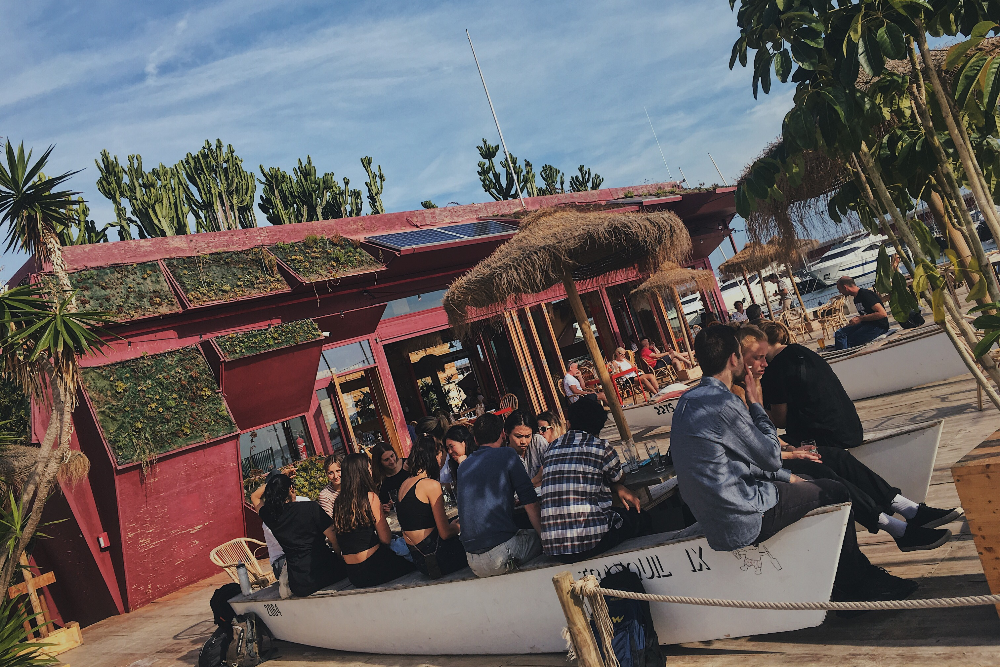
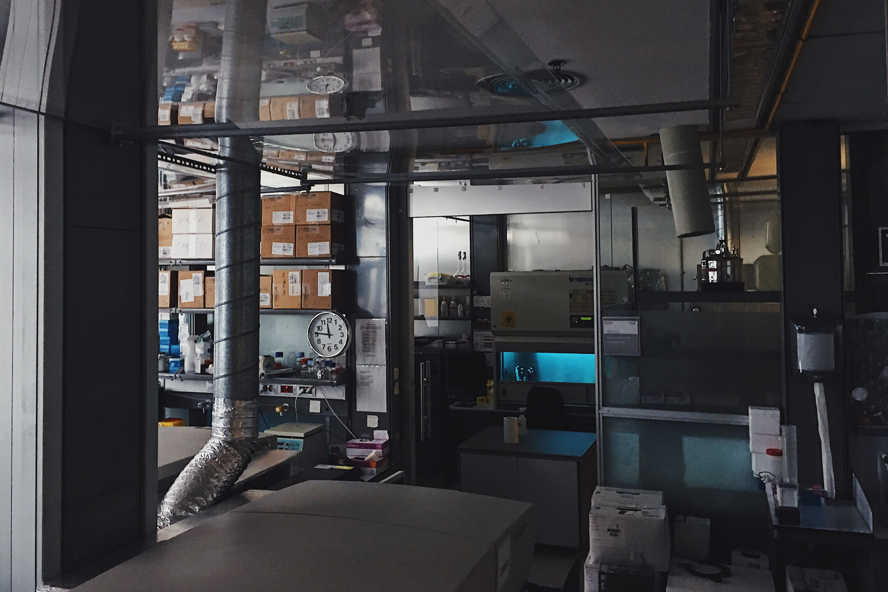
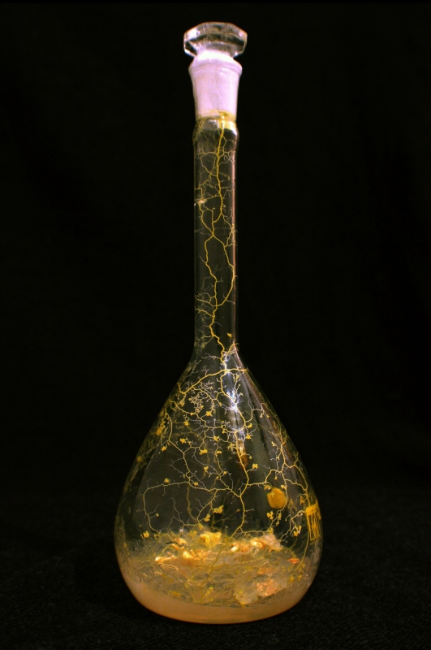

This week can be summarised as an in-depth crash course in synthetic biology with a particular focus on molecular and cellular biology. The course consisted of dense theoretical lectures, presentations from practitioners and occasional group discussions followed by a series of lab workshops and experiments. We concluded the week with a tour of the Barcelona Biomedical Research Park.

[Jonathan Minchin](https://twitter.com/JonnyMinch), our intellectual guide throughout the week, challenged the class with thought-provoking questions and provided us with a necessary philosophical grounding. [Dr. Nuria Conde-Pueyo](https://iaac.net/people/nuria-conde-pueyo/) gave us an elaborate intro into both the world of professional bioscience as well as a more humble DIY biohacking movement and she did so in a genuine and authentic manner. Who knew I could get passionate about microorganisms?

[Mette B. Andersen](https://twitter.com/mettebakand) from [Material Design Lab](http://materialdesignlab.dk/) in Copenhagen gave us an impactful primer on what constitutes a meaningful and sustainable design process through her exploration of designers’ relationship with various materials. Thora H. Arnardottir and Jessica Dias, two of the three [Bio Babes](https://www.instagram.com/bio.babes/), presented us with an inspiring showcase of speculative and provocative designs.

## Human-driven evolution

The few group discussions we had felt particularly stimulating, and I found them to be the most valuable component of the course. Naturally, one of the most heated discussions revolved around ethics of genetic modification of crops and implications of Anthropocene. Nuria made an interesting point when she referred to millennia of plant cultivation through agriculture as a form of genetic modification arguing that modern methods are just faster and more precise. She, of course, implied that this is an over-simplification and that she does not agree with some of the practices of multinational corporations like Monsanto.

The point was to illustrate how difficult it is to define where do we as humans draw the line. Is it ok to make plants more nutritious but not make them more resistant to parasites? What about eradicating entire species of organisms, such as mosquitos that transmit infectious diseases? Nuria concluded that we as humanity are ready to go places where natural selection wouldn't and that we need to clean up the mess we made. I'm not so sure whether we may not just end up creating more mess.

<figure>
<iframe src="https://art19.com/shows/the-ezra-klein-show/episodes/e1c07fbc-b8dc-4378-9edc-d6699cddf00e/embed" style="width: 100%; height: 200px; border: 0 none;" scrolling="no"></iframe>
<figcaption>A podcast episode I listened to recently that explores some of the implications of CRISPR-Cas9 technology we discussed in class</figcaption>
</figure>

A particularly fascinating debate arose around the potential of latest advances in biotechnology to augment and control human bodies. For example, we found out that in theory, we could make humans grow wings but not make them able to fly. We also talked about a possibility to hack a human body with chloroplasts so we could run off the energy from sunlight. Again, in theory, it should be possible, but we currently lack the tools and methods to do it. Even if we succeed it would only provide little energy (plants live quite a slow life after all), and we would still need food. Nevertheless, scientists are exploring this area as a way to create a supplementary source of energy for long-haul space exploration. I was happy to find out about a [green sea slug that has already figured it out](https://www.wired.com/2010/01/green-sea-slug/).

Going beyond imaginary speculations, we also touched upon more immediate possibilities of data-driven approach to human evolution. Such as a [pilot project in Estonia](https://www.independent.co.uk/news/world/europe/dna-test-health-advice-disease-genetic-lifestyle-estonia-government-a8287516.html) that aims to read DNA of its citizens and subsequently nudge them towards a healthier lifestyle based on their genetic predispositions. While such an initiative may appear somehow benign in the context of government-led policy, it can quickly gain an Orwellian overtone when our daily economic interactions become predicated on biometric indicators.

<blockquote class="twitter-tweet" data-lang="en">
John Hancock, one of the oldest and largest North American life insurers, will stop underwriting traditional life insurance and instead sell only interactive policies that track fitness and health data through wearable devices
&mdash; Horace Dediu (@asymco) <a href="https://twitter.com/asymco/status/1042417290396852224?ref_src=twsrc%5Etfw">September 19, 2018</a></blockquote>

There are thorny issues of economic inequality being translated into biological inequality that were not sufficiently addressed in the group discussions. Some may argue that this transition is already occurring through uneven access to the latest perks of medical technology and superior dietary habits. This theme will increasingly surface to the mainstream discourse in the coming years but the time to address those issues is already overdue as eloquently argued by Yuval N. Harari in [*Homo Deus*](https://www.goodreads.com/book/show/31138556-homo-deus) and [*21 Lessons for the 21 Century*](https://www.goodreads.com/book/show/38820046-21-lessons-for-the-21st-century).

One of the main takeaways of our discussions was that the pace of scientific progress seems to be stifled by ethical considerations rather than technological capabilities. We could likely already start growing superhuman babies in labs today, but no country is ready to make the jump at the moment or at least not in a public view. If we are to avoid some of the more dire scenarios we need to start having those discussions now before a rogue nation or opportunistic businessmen take a driver’s seat of human evolution.

## Skewed science

Throughout the course, we had to navigate two fundamentally different approaches to science and biology – a professional industry-scale laboratory and DIY home-based bio hacking. The visit to [PRRB](http://www.prbb.org/) in particular has left a conflicting impression on me. On one side I admire the tremendous effort and ingenuity of professional scientists working on advancing our collective knowledge. On the other hand, I am disgruntled with the handling and allocation of resources to obtain questionable gains.

There is a tendency to see science as somehow detached from the dominant economic system. But seeing the lab first-hand makes it clear that science today is very much revolving around money and skewed incentives. The smartest people in the world are toying around with exuberantly expensive machines to provide only incremental advances in the context of existential threats facing our planet today. The combined monetary value of all the machines in a single room depicted bellow could probably provide for the basic human needs of citizens of a small African country.

There does not seem to be a unified narrative for developing practical solutions for a sustainable advancement of humankind. The shift in the mindset seems to be slowly occurring but is mostly contained to one-off projects and PR-oriented initiatives rather than a sustained effort from a scientific community at large. My aim is not to bash on scientists. Despite my remarks, the investments in science still pale in comparison with expenditures on warfare and on obscene spending habits of wealthy nations. My interest lays more in underlying cultural assumptions and perceptions of what constitutes meaningful science.

The question is how can we use the might and knowledge of the global scientific behemoth to provide for every human being (without destroying our planet) before we go further uncovering ultimately inconsequential details and intricacies of molecular structures?

### Limits of perception

The science today is predominantly based on rigid methods predicated on a positivist view of the world that attempts to objectify every aspect of human existence, including our own consciousness. Science is a mere projection of reality, albeit a relatively accurate one. And while it does seem to reasonably explain many things, it cannot escape the observer effect — the fact that we change our reality by the mere attempt to observe it. This makes the scientific method severely limited by our own imperfect senses. We blindly believe what we see in our man-made microscopes and when we are not sure, we try to look closer by building a more powerful microscope.

*How would science look according to a bee or a bat?*

The science today operates at a level of detail that is beyond what a regular traveler on the spaceship Earth can, or should, comprehend. Here I was reminded of Mette's comments on why it is crucial for designers to touch and feel materials they use in their creations. Maybe scientists could put more effort into touching and feeling the objects they are observing before they dive deeper into them?

## Human-scale science

DIY Bio Hacking community offers an alternative vision of science that is modelled around the human needs at a scale of a household. The workshops taught us the basics of operating in a rudimentary home-based laboratory, how to keep your tools and samples sterile and how to mimic tools and methods from professional labs using common household items and maker toolkits, such as pressure cooker instead of an autoclave or Arduino-based monitoring setups instead of overpriced commercial systems.

Such projects tend to be speculative and playful in nature with an underlying goal of making science and biology more accessible and relevant to everyday humans:

> *“Scientific literacy empowers everyone who possesses it to be active contributors to their own health care, the quality of their food, water, and air, their very interactions with their own bodies and the complex world around them.”*
>
> – Meredith L. Patterson, [A Biopunk Manifesto](https://maradydd.livejournal.com/496085.html) (2008)

Much of the DIY biohacking revolves around exploring and cultivating various microorganisms. Over the course of the week I have built up an appreciation for those little creatures and their amazing capacity for self-replication and self-organisation — principles that are the core of the vision of Fab Labs and Fab Cities. Many of the same principles of organic micro-architecture can be translated into our man-made structures through time-tested methods of vernacular design so beautifully described by Victor Papanek in his [Green Imperative](https://www.goodreads.com/book/show/894758.The_Green_Imperative).

<figure>

`youtube: https://www.youtube.com/watch?v=7n36qV4Lk94`

<figcaption>An indigenous approach to mathematical order</figcaption>
</figure>

Two microorganisms in particular have caught my attention. First is slime mould that seems to spread much like the way humans build train networks. And second is mycelium which is an equivalent of nature’s internet and can be used to address many of humanity’s ills, [including our declining population of bees](https://www.nature.com/articles/s41598-018-32194-8) that we rely on for our food.

<figure>

`youtube: https://www.youtube.com/watch?v=2UxGrde1NDA`

<figcaption>What we can learn from slime mould</figcaption>
</figure>

<figure>

`youtube: https://www.youtube.com/watch?v=cwLviP7KaAc`

<figcaption>Paul Stamets on an incredible versatility of fungi</figcaption>
</figure>

## Experiment design

Taking inspiration from the previous sections I have devised a following scientific experiment as part of the course assignment.

Hypothesis: *Mushrooms and mycelial derivatives can to a certain extent fulfil a significant percentage of daily dietary requirements for a family of four.*

Methodology:

1. Identify an average caloric intake of a family of four.
2. Identify minimal viable chemical composition of a mycelium growing incubator.
3. Identify optimal conditions and growth rates of different types of mushrooms.
4. Build a prototype of a mushroom growing kit.
5. Distribute mushroom growing kit to 100 families around the world to test the kit.
6. Incorporate feedback from a testing group to improve the design and yield of the kit.
7. Distribute the improved kit to additional 1000 families.
8. Reiterate steps 6-7 ten times.
9. Develop advanced AI that will optimise the growth of the mushrooms and embed it in the kit.
10. Distribute the kit to every family in the world.
11. Connect the global mycelium network with our internet network.
12. Enable real-time exchange of information and nutrients throughout the global Intracelium network.

## Takeaways

This course has shown me the long-term potential of DIY biohacking for localised human-scale science that can help with some of the most pressing challenges facing us today. It has also made me appreciate micro organisms and has reinvigorated my previous interest in mycelium which I would like to explore further in my future projects. Overall, the course has inspired me to look at nature to learn more about designing and building sustainable self-perpetuating systems.

## Links and resources

- [A Biopunk Manifesto (2008)](https://maradydd.livejournal.com/496085.html)
- [A Cyborg Manifesto (1986)](http://cyborganthropology.com/A_Cyborg_Manifesto)
- [Bio Babes](https://www.instagram.com/bio.babes/) & [Biocentric Design Group](https://www.biocentricdesigngroup.com/)
- [Compound Interest](https://www.compoundchem.com/)
- [DIY Bio](https://diybio.org/)
- [Evolution of design for sustainability: From product design to design for system innovations and transitions](https://www.sciencedirect.com/science/article/pii/S0142694X16300631)
- [Farm Hack](http://farmhack.org/tools)
- [Hackteria](http://www.hackteria.org/)
- [International Genetically Engineered Machine](http://igem.org/About)
- [Material Design Lab](http://materialdesignlab.dk/)
- [Organovo](https://organovo.com/)
- [The BK Reactor](http://www.bkbioreactor.com/)
- [theLabRat.com](http://thelabrat.com/)