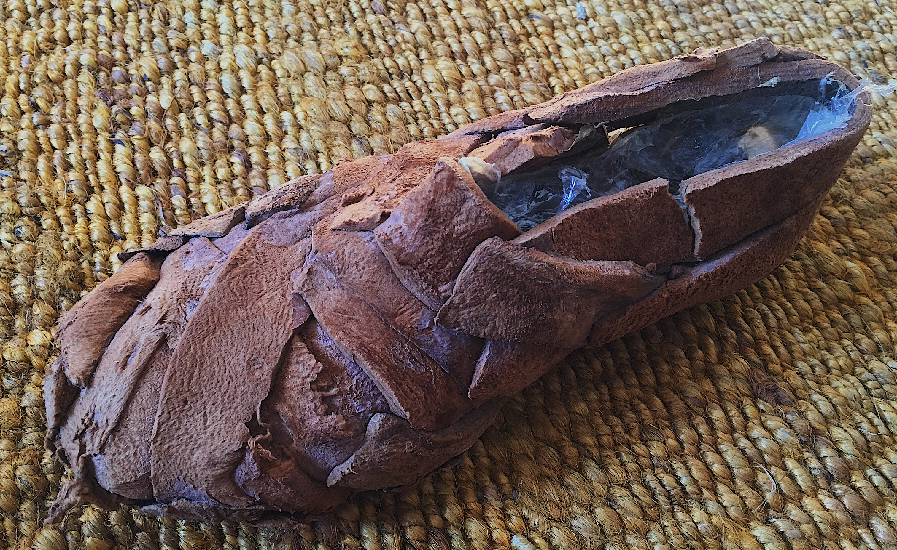
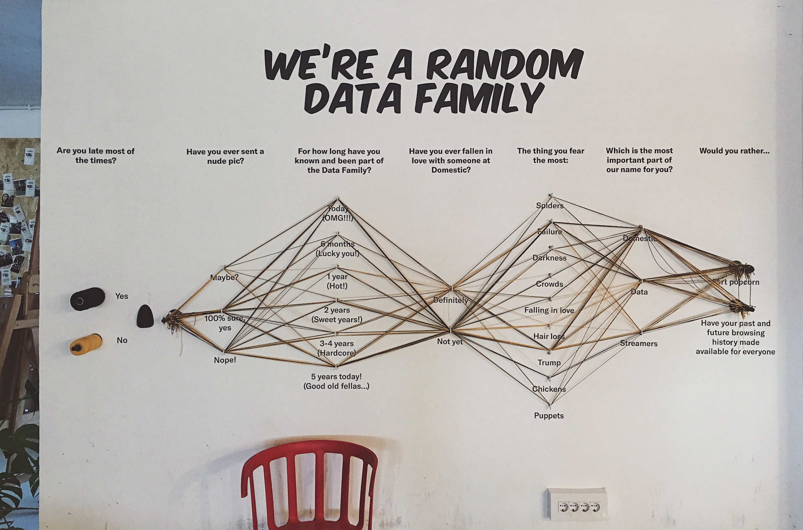
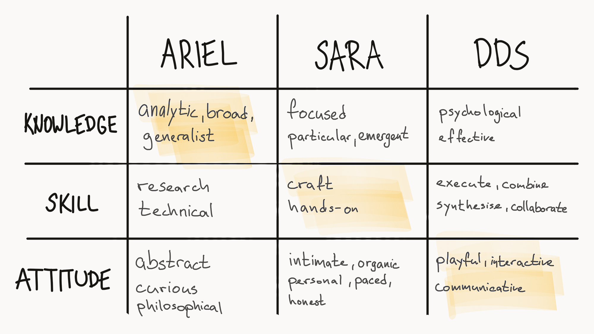
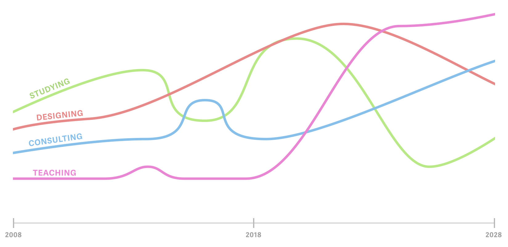

This week was held in the spirit of soul searching, self-exploration and reflection. In the first part of the course, we have visited studios of three different ‘hybrid designers’ that have at some point diverged from their original craft to establish a unique profession for themselves. In the second half of the week, we have worked with [Oscar Tomico](http://www.elisava.net/en/center/professorate/oscar-tomico-plasencia) on relating our impressions from the visits to our personal strengths/weaknesses and developing our professional vision for the future.

## Gathering inspiration

I wonder to what extent was the choice of designers a result of a deliberate, carefully planned decision-making or whether it was just one of those lucky synchronistic chains of seemingly random events. In either case, the designers that were chosen to share their stories with us were neatly complimenting each other, offering us an insight into different perspectives, approaches and working contexts that when put together formed a holistic framework for thinking about our own professional practice.

### Ariel Guersenzvaig

[Website](https://interacciones.org/) / [Twitter](https://twitter.com/interacciones) / [Elisava profile](http://www.elisava.net/en/center/professorate/ariel-guersenzvaig)

As a student, Ariel’s had developed a keen interest in the field of Human-Computer Interaction that gradually evolved into working as an Information Architect building web solutions for various clients (at a time when IA was just becoming a thing). He eventually started teaching at Elisava while doing occasional consulting for different companies and organisations. He is also pursuing a PhD in philosophy.

Up to this point in my life, I have followed a more or less the same professional path myself, so the presentation from Ariel was particularly inspiring to me. In the future, I would also like to teach at a university while doing independent consulting. And I’m not going to lie, philosophy has been on my radar for a while now as well. At times, it almost felt eerie how much in common I shared with Ariel :-)

### Sara de Ubieta

[Website](http://www.deubieta.com/) / [Instagram](https://www.instagram.com/sara_deubieta) / [Tumblr](http://deubieta.tumblr.com/)

Sara went from architecture school straight into traditional artisanal training. She spent years under the guidance of an experienced shoemaker, learning how to make shoes and exploring material properties of leather. She eventually verged out to create her own practice repurposing and experimenting with unusual combinations of materials to develop unconventional shoe designs.

It was fascinating to learn about Sara’s professional transition, but for me, it was almost unimportant what specifically she did because I was absolutely blown away by the way she approaches her work and her intimate relationship with the tools and materials. Sara’s hones her craft, and her sheer enthusiasm, energy and presence were truly inspiring and motivating. It was humbling to see someone so honest, content and at peace with what they do.

### Domestic Data Streamers (DDS)

[Website](http://domesticstreamers.com/) / [Twitter](https://twitter.com/domesticstream) / [Instagram](https://www.instagram.com/domesticdatastreamers/) / [Vimeo](https://vimeo.com/domesticdatastreamers)

DDS is a consultancy design firm that aims to “to create meaningful connections between information and people” [^1]. It came about as a collaboration between Pol and Marta, both Elisava alumni.

> *“Living in the age of information overload is not easy so people end up scrolling through their lives.”*
>
> – Domestic Data Streamers (2018) [^2]

## Looking inward

Oscar suggested that we use *knowledge*, *skill* and *attitude* as dimensions against which to reflect on our professional aptitudes in relation to our impressions from the visits and courses we have in the first term of the MDEF master’s programme.

**Knowledge** — *How I know* — I aspire to view the world as a polymath with a broad knowledge of how tightly interlinked networks of complex systems interact with each other (Ariel).

**Skill** — *How I do* — I want to view my design practice as a craft by developing an honest and intimate relationship with the tools and materials I use in my daily practice (Sara).

**Attitude** — *How I relate* — I want to be able to communicate complex ideas in an accessible and playful manner (DDS).

An interesting moment of self-reflection occurred as a result of a group discussion. I have realised that one of my strongest suits is organising and systematising things, tools, information and knowledge. But this approach also limits my ability to think freely. It sometimes quite literally makes me think inside a box (a Trello card). It is also probably a reason that I find it easiest to express my creativity through words and code rather than visuals. During the programme, I would like to practice letting my mind (and hands) a bit more loose.

## Looking forward

As part of the course, we have been tasked with stating our vision. Mine reads as follows:

*Facilitate activities for collective creation and development of sustainable modes of living in a harmonious relationship between nature, technology and society.*

Behind this vague and abstract statement hides a rather simple goal. Rather than develop solutions myself, I would like to help others make the best out of their design capabilities - through activities such as teaching, mentoring, consulting, networking and organising workshops/events.

By being able to synthesise ideas from different fields and disciplines I feel like I am well positioned to connect the right people at the right time to collaborate on making a world a better place through initiatives that promote healthier relationships between humans, environment and technology. I would still like to hone a craft of my own but in a more slow-paced hobby-like form, rather than a full-time professional endeavour.

I used Ariel’s graphic which traces how his career has evolved over the years as an inspiration to create a following rough projection of where I was and where I want to be in the next 10 years in relation to types professional activities I am engaged in:

A first step towards fulfilling my vision is improving in areas that I currently lack in. Therefore I have put together a following shortlist of goals and aspirations for the near future:

- I want to improve communicating ideas visually
- I want to communicate my knowledge in a more positive, constructive, inspiring and playful manner
- I want to collaborate more with others
- I want to build more using my hands

## Takeaways

A major theme throughout the course was seeing *design as a person* and a *designer as a tool* which is a powerful way to look at one’s professional practice. It forces you to scrutinise your values and views which you inherently embed into your designs – something that is necessary now more than ever.

The course made me realise how vague and tentative my vision is. I suppose that is a good thing at this stage of the master's programme. It gives me room to work toward developing a more concrete plan of action. Overall the course was a stimulating and inspiring experience.

[^1]: DDS presentation to the MDEF student group on 24 October 2018
[^2]: ibid.
