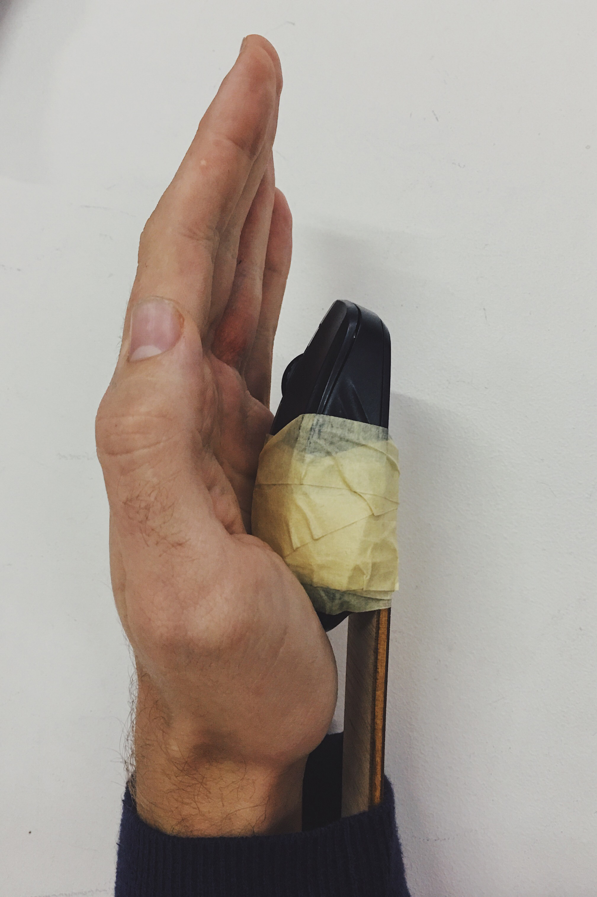
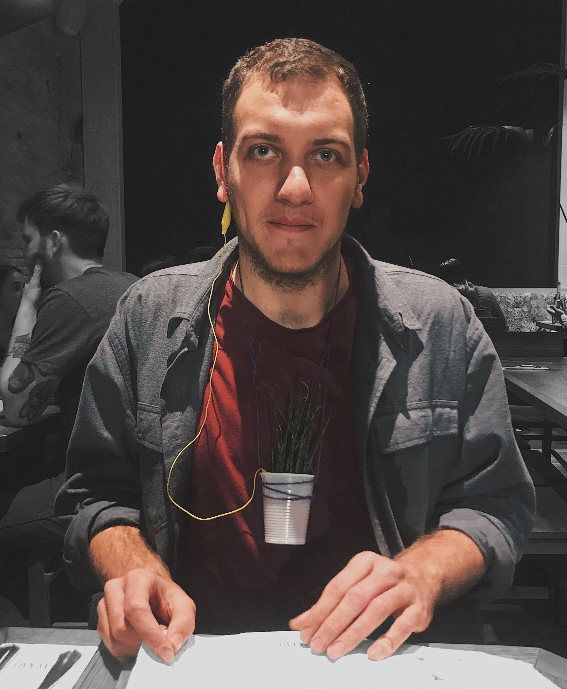

This week we have engaged with our project ideas through the lens of speculative design. We went through a series of excersises in which we tried to materialise abstract concepts by customising simple everyday objects and spending time living with them. We then reflected on our experiences in relation to how they made us feel and how they relate to themes we are exploring in our projects.

>  *“Speculacting throught design by presenting abstract issues as fictional products enables us to explore ethical and social issues within the context of everyday life.”*
>
> — Anthony Dunne & Fiona Raby, Speculative Everything [^1]

## Scroll My Life ©

We started the first exercise by laying out various objects on a table as a group. Everybody then intuitively chose one object (which was not theirs) and customised it in ways that subvert its original meaning or purpose.

I choose an old computer mouse. Immediately after grabbing it I was drawn to the haptic sensation from scrolling the wheel. It quickly evoked the idea of aimless scrolling on social media. After considering a few different what-if scenarios, I set out to explore the following question:

*What if you could scroll through social encounters the way you do on social media?*

I attached the mouse underneath the palm of my left hand using a small wooden plank, some duck tape and a few rubber bands. For the next hour or so I was strolling around IAAC observing how interested/attentive I was towards anything or anyone I encountered. When I was getting unfocused and wanted to move on, I scrolled faster. When something caught my interest, I scrolled slowly and stopped scrolling entirely if I was fully present. Pretty much exactly how we treat feeds on social media.

I instantly realised that I would have to explicitly indicate to others that I’m not interested in speaking with them which made me quite uncomfortable. As a result of this awry feeling, I tried to keep my scrolling discreet or random when encountering others. It was interesting to contrast the experience with our behaviour on social media where we scroll over things that do not interest us with absolutely no sense of guilt or consideration for the person on the other end.

In the end, due to my reluctance to *scroll away from social interactions*, the prototype has served primarily as a mnemonic device that helped me be more conscious of my attention span and level of concentration. The result was a sort of consciously performed motoric tic.

## Living with a plant

As a final exercise we had to materialise our ideas for a final project. My focus is on exploring plant/non-human intelligence (consciousness) in the context of anthropocene and exponential technology. To explore our relationship with other living organisms more closely I picked a plant that I brought to the class a few weeks earlier, hanged it around my neck, attached a wire to it which I connected to my ear and walked around the city with it for the rest of the day. Coincidentally, my mum was visiting me that week, which made the whole experience even more interesting.

*What does the forest talk about?*

*Do plants gossip? Do they tell jokes?* 

*What would plants tell us if they could talk?*

*How does pain feel to a tree?*

The purpose of the experiment was to personify a plant and view it as an intimate personal object that we carry around everywhere we go (like we do with our smartphones) – a plant tamagotchi of sorts.

The whole thing has started as a bit of a gimmick, but it eventually sinked in and made me question my own relationship with the natural world. While I love and cherish plants, I realised I do not engage with them deeply enough by going out into the forest more often and noticing subtle changes they go through over extended periods.

As a result of this realisation, I have started reading Plant Intelligence by Stephen H. Buhner which has already begun to shift my perception of non-human living beings significantly.[^2]  It has also motivated me to wander around the city and pay closer attention to the trees and plants around me.

## Takeaways

At first, I was sceptical of speculation as a tool for engaging with psychological and cultural issues. I tend to view it more as an artistic endeavour rather than a medium for creating a meaningful change in how people interact with the world. While I am still somewhat sceptical of its utility convince others, I have come to realise that speculation is a powerful way to uncover hidden assumptions, attitudes and biases inherent in my own ways of thinking.

[^1]: [Speculative Everything](https://www.goodreads.com/book/show/17756296-speculative-everything)
[^2]: [Plant Intelligence and the Imaginal Realm](https://www.goodreads.com/book/show/18223784-plant-intelligence-and-the-imaginal-realm)

