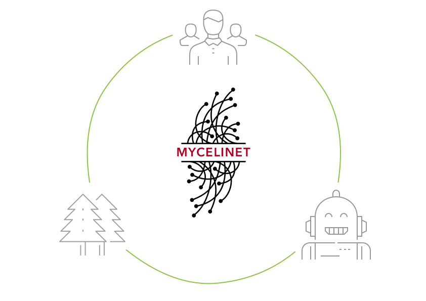

This week we worked on conveying our ideas for final projects in an engaging and relatable manner. The sessions with Heather from Kickstarter, in particular, have stressed the importance of translating elusive and abstract concepts into tangible and concrete actions or artefacts to appeal to wider audiences.

## Engaging species

Faced with the most significant existential threat in human history we are in a dire need to drastically reevaluate our relationship with technology, nature and each other. The numerous environmental, cultural and political challenges are directly linked to our dysfunctional relationship with the world that surrounds us. According to Jung we lack emotional participation with nature which has resulted in a ‘sense of cosmic and social isolation’ [^1]

> *“The planet is dying because we are satisfied with our limited relationships in which control, denial, and abuse are tolerated. The status quo is that we have these petty relationships with each other, between nations, with ourselves and the natural world. Why should we bother? Because healthy relationships are not an esoteric goal. It is a matter of our very survival and the survival of most of the life upon this earth.”*
>
>
>
> — Terrance O’Connor, Therapy for a Dying Planet (1995) [^2]

The Gaian view of earth a large self-organising organism has been dismissed as pseudoscience at the time it was proposed by James E. Lovelock in the 1970s.[^3] However, new scientific findings increasingly give empirical validity to an idea intuitively held by many – that the planet Earth and virtually everything on it is sentient and that we are able to communicate with it.

> *“The Gaia theory has found such powerful purchase in the human world because it reminds us of something many of us intuitively know to be true (and which every four-year-old child understands): that the world is alive, intelligent, aware, communicative, and filled with soul; that we are not alone; that we are part of something much larger than ourselves; that we are companioned by millions upon millions of related life-forms; and that the dead, mechanical world we have been taught about in school does not exist . . . and never has. It restores a crucial dimension to human life, and human habitation of this planet.”*
>
>
>
> — Stephen H. Buhner, Plant Intelligence and the Imaginal Realm (2014) [^4]

To have a healthier human-to-planet relationship we need to stop thinking of planet Earth through a purely materialistic lense. A shift away from anthropocentric human-centred design towards a holistic multi-species approach is necessary.

*How do we restore the lost connection to the ever-present invisible planetary meta-consciousness?*

As part of my MDEF story, I would like to propose that fungi contain at least part of the answer to that question.

## Fungal link

Mushroom-based innovation – or mycotechnologies[^5] – may turn out to be the key for improving and preserving planetary health. On a pragmatic note fungi have countless potential applications in stabilising the world's biomes, enhancing food production and healtcare. On a psychological and spiritual level the metaphone of mycelium as the Earth's natural internet provides a potential link between humans, plants and machines.

*A symbiotic merger of humans, fungi and AI into a supra-terrestrial hyper-conscious meta-organism through AI-mediated human-mycelium interface for spiritual awakening and perpetual food production.*

> *“I see the mycelium as the Earth’s natural Internet, a consciousness with which we might be able to communicate. Through cross-species interfacing, we may one day exchange information with these sentient cellular networks. Because these externalized neurological nets sense any impression upon them, from footsteps to falling tree branches, they could relay enormous amounts of data regarding the movements of all organisms through the landscape.”*
>
>
>
> — Paul Stamets, Mycelium Running (2005) [^6]

### Enter Mycelinet

**Project title:** Mycelinet - networked biodegradable mushroom kit

**Project subtitle:** Biodegradable kit for growing edible mushrooms from used coffee grinds and other household waste. Comes with a revolutionary interface for talking with your mushrooms. Connect your kit to our platform to share data, know-how and harvest with local growers.

## Takeaways

The course has brought home the importance of distilling complex and abstract issues in a relatable and simple manner in order to engage varying audiences with ever-shorter attention spans.

[^1]: [The Earth Has a Soul](https://www.goodreads.com/book/show/123633.The_Earth_Has_a_Soul)
[^2]: [Ecopsychology](https://www.goodreads.com/book/show/802184.Ecopsychology)
[^3]: [Gaia](https://www.goodreads.com/book/show/274230.Gaia)
[^4]: [Plant Intelligence and the Imaginal Realm](https://www.goodreads.com/book/show/18223784-plant-intelligence-and-the-imaginal-realm)
[^5]: [Mycelium running](https://www.goodreads.com/book/show/239395.Mycelium_Running)
[^6]: ibid.

