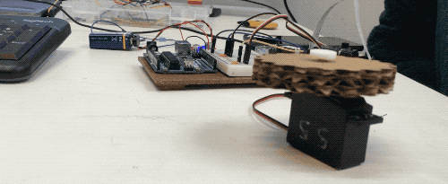

This week was a sort of a precursor to the Fab Academy course that we will be attending in the upcoming term. The focus was on going from an idea to a working prototype in the shortest possible time prioritising tools and materials that allow for experimentation and quick iteration.

In the spirit of previous collaborative projects our group has choose to work with plants again. In this case by putting wheels on them and letting them take revenge for global warming. Enter Sassy Plants.

    
    

In this post I will comment on my personal experience and mostly technical takeaways. For a more detailed documentation please visit a [dedicated Sassy Plants homepage](https://mdef.gitlab.io/sassy-plants/) and the [project’s GitLab repository](https://gitlab.com/MDEF/sassy-plants).

## A burned Pi

The original idea was to attach a camera to the plant so it could follow and attack its human overlords using facial-recognition software. Initially, we had trouble getting the Raspberry Pi to detect a camera module. We fixed the problem by switching to a different Pi, which unfortunately did not last for long.

It was surprisingly easy to get a object-detection software running using Python and [OpenCV library](https://opencv.org/). But since we were running the recognition on a real-time video feed the Pi’s limited hardware started to freak out and generate a lot of heat. Long story short, the Pi did not turn on after we tried to restart it. It was at this point that we have abandoned the idea of the plant autonomously following humans and instead opted out for controlling it remotely using a web interface.

## Expanding my webdev horizons

This course was my first genuine entry into developing for Raspberry Pi. In theory I knew that Pi is just a simple Linux machine but I had not fully realized the implications of that fact until I have actually booted up the DebianOS and started toying around with it. I quickly realised that it was just like developing on a web server with an added option to plug in a keyboard and mouse and see what is going on an external monitor.

It was a true aha moment when I found out that I can use my web development skills to build something other than a website - say a remotely controlled plant robot.

The basic setup consists of Raspberry Pi running a Flask web server that exposes five API endpoints: `control/up`, `control/down`, `control/left`, `control/right`, `control/stop`. Sending a HTTP request to any of these endpoints sends corresponding instructions to the two motors attached to the Pi allowing it to be controlled remotely. Using the [Dataplicity](https://www.dataplicity.com/) IoT platform we were able to create a a direct SSH tunnel to our Pi which allowed us to propagate requests to our local-only Pi’s server by sending a simple HTTP request to API Dataplicity’s endpoints via a custom mobile-ready website.

## Raspberry me

Working on this project has convinced me about the power and possibilities of Raspberry Pi. I am sure I will use it as a control center for various sensing and interactive projects in the future.
